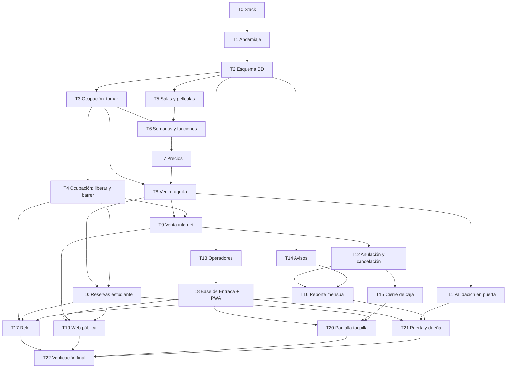

# Plan de implementación — Sistema de venta de entradas del Cine Variedades

> **Para quien ejecute este plan:** cada tarea se desarrolla en **su propia sesión**, una a una,
> siguiendo el ciclo obligatorio de `CLAUDE.md` §4 (diagnóstico → propuesta → autorización →
> implementación → verificación). El seguimiento se lleva con las casillas `- [ ]` de cada tarea.
> Al abrir una sesión de trabajo basta con leer `CLAUDE.md`, este archivo y la tarea elegida con
> sus referencias; no hace falta cargar el resto del contexto.

**Objetivo:** construir el sistema descrito en `ESPECIFICACION.md` con la arquitectura de
`DISENO.md`: un solo servicio web con base de datos relacional, siete componentes de dominio y una
capa de entrada.

**Arquitectura:** componentes con dependencias en una sola dirección (Ocupación no conoce a nadie;
nadie conoce a Entrada ni al Reloj). La garantía de no doble venta (`RNF-4`) vive en la restricción
de unicidad sobre (función, butaca), no en código.

**Stack (decidido en T0, registrado en `DISENO.md`):** **TypeScript** en todo el proyecto —
Node.js con **Fastify** en el servidor, **React con `@carbon/react`** en la PWA—, **SQLite en
modo WAL** como base de datos y **planificador embebido** (node-cron) para el Reloj. Interfaz
inspirada en **Carbon Design System (IBM)** y aplicación **PWA** (ver `CLAUDE.md` §8). Queda
abierto solo el proveedor de correo (a más tardar en T14).

## Restricciones globales

Aplican a todas las tareas; cada una las incluye implícitamente.

* Español en dominio, mensajes y documentación; terminología del glosario de `ESPECIFICACION.md`
  (nunca «boleto» por «entrada»).
* Toda pieza de código se justifica citando sus `RN-` / `RF-` / `RNF-` / `REG-` / `CA-`.
* Ninguna regla de negocio nueva, ninguna relajada, ningún alcance reintroducido.
* Toda operación que toca butacas es **una sola transacción** (promesa transversal de `DISENO.md`).
* Desarrollo guiado por pruebas: primero la prueba que falla, después el mínimo que la hace pasar.
* Un commit por tarea como mínimo, con mensaje `Week3 Tn: <componente> — <qué>`. Sin `push` ni
  commit sin pedido explícito del usuario.
* UI: skill `ui-ux-pro-max` obligatoria antes de cualquier pantalla (`CLAUDE.md` §8); contraste,
  foco visible y objetivos táctiles de 44×44 px como mínimos no negociables.

## Ciclo estándar de cada tarea

Los pasos son los mismos en todas; lo que cambia por tarea son comportamientos, archivos e
interfaces. En cada sesión:

1. `- [ ]` Diagnóstico: releer la tarea, sus referencias en `ESPECIFICACION.md` y `DISENO.md`.
2. `- [ ]` Propuesta breve al usuario y **autorización explícita**.
3. `- [ ]` Por cada comportamiento listado: prueba que falla → verla fallar → implementación
   mínima → verla pasar.
4. `- [ ]` Ejecutar la suite completa; mostrar el resultado.
5. `- [ ]` Revisar el diff: nada fuera del alcance de la tarea.
6. `- [ ]` Commit y actualización de la casilla de la tarea en este archivo.

## Mapa de dependencias entre tareas

### Qué puede ir en paralelo

Una tarea por sesión no impide alternar carriles: dos tareas de carriles distintos no comparten
archivos y pueden hacerse en cualquier orden (o en worktrees separados).

| Momento | Carriles independientes entre sí |
|---|---|
| Tras T2 | **A:** T3 → T4 (Ocupación) · **B:** T5 (Cartelera) · **C:** T13 (Operadores) · **D:** T14 (Avisos) |
| Tras T3 + T5 | B continúa: T6 → T7 |
| Tras T8 (+T4) | T9, T10 y T11 en cualquier orden o en paralelo |
| Tras T13 | T18 puede avanzar en paralelo con todo el carril de Venta (T8–T12) |
| Tras T12 | T15 y T16 en paralelo |
| Al final | T19, T20 y T21 en cualquier orden cuando sus dependencias estén; T17 en paralelo con ellas |

**Secuencia recomendada si se va una tarea por vez:**
T0 · T1 · T2 · T3 · T5 · T4 · T6 · T13 · T7 · T14 · T8 · T9 · T10 · T11 · T12 · T15 · T16 · T17 ·
T18 · T19 · T20 · T21 · T22.

**Camino crítico** (lo que no se puede acortar): T0 → T1 → T2 → T3 → T6 → T7 → T8 → T9 → T12 →
T15 → T20 → T22.

---

## Etapa previa (cierran la Sesión 4)

### - [x] T0 — Decidir el stack con el usuario

**Depende de:** nada. **Bloquea:** todo lo demás.
**Produce:** decisión registrada de motor de BD relacional, lenguaje y marco del servicio, y
mecanismo de tareas programadas (el proveedor de correo puede diferirse hasta T14, porque Avisos
lo aísla tras una interfaz).

* Presentar 2–3 alternativas por decisión con ventajas y desventajas, compatibles con lo ya
  decidido: transacciones y restricción de unicidad (`DISENO.md`, decisión 2), PWA y Carbon
  (`CLAUDE.md` §8).
* El usuario elige; la elección se registra en `DISENO.md` («Decisiones dejadas abiertas» →
  resueltas) con el formato de «Otras decisiones», con su aprobación sección por sección.
* Sin código: esta tarea solo produce decisión y registro.

### - [x] T1 — Andamiaje del proyecto

**Depende de:** T0.
**Produce:** estructura de carpetas por componente (`ocupacion/`, `cartelera/`, `venta/`,
`salidas/`, `avisos/`, `operadores/`, `reloj/`, `entrada/`), gestor de dependencias, base de
pruebas ejecutable, conexión a BD y mecanismo de migraciones. Las rutas exactas de archivos de
las tareas siguientes quedan fijadas por esta estructura.

* Comportamiento verificable: la suite de pruebas corre (vacía o con una prueba trivial) y una
  migración vacía aplica y revierte.
* Primer archivo de código del proyecto: requiere la autorización explícita de construir.

### - [x] T2 — Esquema de base de datos

**Depende de:** T1.
**Produce:** migraciones para las 13 entidades del modelo de `DISENO.md` (Sala, Butaca, Película,
SemanaCartelera, Función, PrecioVigente, Ocupación, Reserva, Compra, Entrada, Operador,
EnvíoReporte, Configuración), con compra y reserva en **dos tablas separadas** (decisión del
modelo) y la **restricción de unicidad sobre (función, butaca)** en la tabla de ocupación.

* Comportamientos verificables: las migraciones aplican desde cero; insertar dos filas de
  ocupación con la misma (función, butaca) falla por el motor (`RNF-4`, `CA-1`); el esquema no
  contradice ninguna entidad del modelo (revisión contra la tabla de `DISENO.md`).

## Fase 1 — Ocupación

### - [x] T3 — Tomar y consultar butacas

**Depende de:** T2. **Paralelizable con:** T5, T13, T14.
**Archivos:** componente `ocupacion/` y sus pruebas.
**Produce (interfaz para T6, T8, T9, T10):**
`tomar(función, butacas[], motivo, referencia, vencimiento?) → todas tomadas | lista de las que se
adelantaron` · `tomadas(función) → [(butaca, motivo, referencia)]` · `¿tieneTomadas?(función) → sí/no`.

* Comportamientos: toma todo o nada sin importar el tamaño del grupo (`RN-22`); al chocar,
  devuelve exactamente cuáles se adelantaron; la secuencia es una sola transacción que borra
  vencidas de las butacas pedidas antes de insertar (`DISENO.md`, «la operación crítica»); una
  fila vencida se comporta como libre al leer, desde el instante exacto (`RN-17`–`RN-20`); dos
  procesos concurrentes sobre la misma butaca: uno gana, el otro recibe el rechazo.

### - [x] T4 — Liberar, vencer y barrer

**Depende de:** T3.
**Archivos:** componente `ocupacion/` y sus pruebas.
**Produce (interfaz para T9, T10, T12, T17):**
`liberar(referencia) → void` · `cambiarMotivo(referencia, nuevoMotivo, nuevaReferencia) → void`
(bloqueo/reserva → venta) · `barrer() → cantidad borrada`.

* Comportamientos: liberar borra todas las filas de una referencia (anulación, cancelación,
  reserva no convertida); el cambio de motivo conserva la butaca sin ventana en que otro pueda
  tomarla; el barrido borra solo vencidas (`REG-8`) y si no corre, nada se rompe: la venta sigue
  funcionando (decisión 4 de `DISENO.md`).

## Fase 2 — Cartelera

### - [x] T5 — Salas, butacas fijas y películas

**Depende de:** T2. **Paralelizable con:** T3, T13, T14.
**Archivos:** componente `cartelera/` y sus pruebas; datos semilla de salas.
**Produce (interfaz para T6, T18–T21):** `butacasDe(sala) → [butaca]` · alta/consulta de películas
con duración.

* Comportamientos: Sala 1 con filas A–J de 12 butacas, Sala 2 con filas A–F de 10; 180 en total,
  creadas una sola vez e inmutables (`RN-1`, `RN-2`); identificación por fila y número (`A1`,
  `F7`); película exige título y duración (`RN-4`).

### - [x] T6 — Semanas de cartelera y funciones

**Depende de:** T5 y T3 (consulta `¿tieneTomadas?`).
**Archivos:** componente `cartelera/` y sus pruebas.
**Produce (interfaz para T7–T12, T19):** alta/edición/cancelación lógica de funciones ·
`enVenta(función) → sí/no` · semanas jueves a miércoles con apertura de venta.

* Comportamientos: semana de jueves a miércoles con su apertura (`RN-3`, `RN-8`, `RN-9`); margen
  mínimo de 20 minutos entre funciones de la misma sala, con mensaje que dice la primera hora
  posible (`RN-5`, `RN-6`, tabla de errores); una función con butacas tomadas no se modifica ni
  elimina (`RF-4`); «en venta» = semana abierta, no cancelada, no empezada.

### - [x] T7 — Precios vigentes

**Depende de:** T6.
**Archivos:** componente `cartelera/` y sus pruebas.
**Produce (interfaz para T8–T10):** `precio(función, categoría) → monto`, con historial con fecha
desde.

* Comportamientos: precio general y de estudiante según la fecha de la función (`RN-12`–`RN-15`);
  un cambio de precio no altera lo ya vendido — el congelado es responsabilidad de Venta
  (`RN-16`); el historial permite explicar un monto viejo (decisión de `DISENO.md`).

## Fase 3 — Venta

**Interfaz de Avisos usada desde acá (contrato fijo, implementación real en T14):**
`encolar(destinatario, asunto, cuerpo, adjunto?) → void` — **acepta siempre, nunca falla ni
bloquea** (`RNF-5`). Hasta T14 se usa una implementación simulada en pruebas.

### - [x] T8 — Compra en taquilla

**Depende de:** T3 y T7.
**Archivos:** componente `venta/` y sus pruebas.
**Produce (interfaz para T9–T12, T15, T20):** `venderEnTaquilla(función, butacas+categorías,
operador) → compra` · `buscarCompra(número) → compra con entradas` · generación del número de
compra · cálculo de jornada.

* Comportamientos: venta directa sin paso intermedio (`RN-20`); número de 6 caracteres sin
  `0/O/1/I/L` (`RN-25`); monto congelado por entrada (`RN-16`, `CA-4`); jornada con corte 06:00
  congelada al escribir (`RN-10`, `RN-11`, `CA-8`); si Ocupación rechaza, no queda rastro
  (`REG-1`, `REG-2`); función no «en venta» → rechazo.

### - [x] T9 — Compra por internet

**Depende de:** T8 y T4. **Paralelizable con:** T10, T11.
**Archivos:** componente `venta/` y sus pruebas.
**Produce (interfaz para T12, T19):** `bloquear(función, butacas, sesiónAnónima) → bloqueo con
vencimiento` · `pagar(bloqueo, contacto) → compra` (punto único del pago simulado).

* Comportamientos: bloqueo de 5 minutos (`RN-19`); pago exitoso convierte bloqueo en venta sin
  ventana (`RN-26`, vía `cambiarMotivo` de T4); pago fallido no deja rastro y el bloqueo sigue
  vivo (tabla de errores); bloqueo vencido → rechazo «las butacas volvieron a estar libres»
  (`REG-8`); la compra guarda contacto y canal internet; el correo del número se encola vía la
  interfaz de Avisos y su falla no revierte nada (`RNF-5`).

### - [x] T10 — Reservas de estudiante

**Depende de:** T8 y T4. **Paralelizable con:** T9, T11.
**Archivos:** componente `venta/` y sus pruebas.
**Produce (interfaz para T17, T19, T20):** `reservar(función, datos) → reserva con número` ·
`convertir(número, conCarné, operador) → compra` · barrido de reservas vencidas.

* Comportamientos: la reserva vive en su propia tabla y **no aparece en ninguna consulta de
  ventas** (decisión del modelo); conserva el número al convertirse (`RN-25`); con carné cobra
  precio estudiante, sin carné precio general (`RN-28`, `RN-31`, `RN-32`); vence al empezar la
  función y se borra (`RN-30`, `RN-34`); el barrido de Venta borra reservas vencidas y llama al
  `barrer()` de Ocupación.

### - [ ] T11 — Validación en puerta

**Depende de:** T8. **Paralelizable con:** T9, T10.
**Archivos:** componente `venta/` y sus pruebas.
**Produce (interfaz para T21):** `validar(número, operador) → entradas marcadas` · búsqueda por
nombre o correo.

* Comportamientos: marca instante y operador en cada entrada (`RF-18`, `RF-19`, `REG-2`); ya
  usadas → rechazo «se validaron a las HH:MM, por N» sin registrar nada nuevo; número inexistente
  → ofrecer búsqueda alternativa; número de otra función → decir de cuál es (tabla de errores).

### - [ ] T12 — Anulación, cancelación y devoluciones

**Depende de:** T9.
**Archivos:** componente `venta/` y sus pruebas.
**Produce (interfaz para T15, T16, T20, T21):** `anular(compra, operador, motivo) → void` ·
`cancelarFunción(función, operador, motivo) → compras devueltas` · `marcarDevoluciónEntregada
(compra, operador) → void`.

* Comportamientos: anulación con permiso, plazo y motivo; libera todas las butacas (`RF-21`–
  `RF-23`, `RN-40`, `REG-4`); compra validada no se anula; fuera de plazo → rechazo; cancelar
  deja la función cancelada, todas las compras devueltas y encola un aviso por comprador de
  internet (`RN-41`, `RF-24`, vía interfaz de Avisos); devolución en efectivo marcada con
  operador, instante y jornada (`RF-25`, `REG-5`).

## Fase 4 — Salidas, Avisos y Operadores

### - [ ] T13 — Operadores

**Depende de:** T2. **Paralelizable con:** T3–T12 (no comparte archivos con nadie).
**Archivos:** componente `operadores/` y sus pruebas.
**Produce (interfaz para T18):** `identificar(PIN) → operador con puesto | nada` ·
`¿puede?(operador, operación) → sí/no` · abrir/cerrar sesión de jornada.

* Comportamientos: tres puestos con sus permisos (`RN-50`–`RN-53`); PIN corto por operador con
  sesión que se cierra al terminar la jornada (decisión de `DISENO.md`); `¿puede?` responde por
  operación (`RN-54`, `RF-32`); ningún concepto de cuenta de comprador (`RN-55`).

### - [ ] T14 — Avisos

**Depende de:** T2. **Paralelizable con:** T3–T13.
**Archivos:** componente `avisos/` y sus pruebas.
**Produce:** la implementación real del contrato ya fijado: `encolar(destinatario, asunto,
cuerpo, adjunto?) → void`, más el envío con proveedor aislado tras interfaz de un método.

* Comportamientos: encolar nunca falla ni bloquea (`RNF-5`); reintentos con espaciado creciente
  durante 24 horas y después marcado fallido y visible (`RN-48`); el proveedor concreto se decide
  con el usuario en esta tarea (o antes) y se conecta sin tocar a quienes encolan.

### - [ ] T15 — Cierre de caja

**Depende de:** T12. **Paralelizable con:** T16, T18.
**Archivos:** componente `salidas/` y sus pruebas.
**Produce (interfaz para T20):** `cierreDeCaja(jornada) → ventanilla + internet`.

* Comportamientos: dos partes, ventanilla e internet (`RN-46`, `RF-26`); efectivo esperado =
  taquilla de la jornada menos devoluciones entregadas en esa jornada; cálculo al vuelo sin foto
  (decisión de `DISENO.md`); las reservas no suman jamás (viven en otra tabla); solo lectura:
  correr dos veces no cambia nada.

### - [ ] T16 — Reporte mensual y consultas

**Depende de:** T12 y T14. **Paralelizable con:** T15, T18.
**Archivos:** componente `salidas/` y sus pruebas.
**Produce (interfaz para T17, T21):** `reporteMensual(mes) → detalle por función con canceladas
marcadas` · `enviarReporte(mes) → registro del envío` · correo del distribuidor configurable ·
consultas de ocupación y por categoría/canal.

* Comportamientos: detalle función por función con canceladas marcadas (`RF-27`); envío por
  Avisos como hoja de cálculo adjunta con resumen en el cuerpo (decisión de `DISENO.md`),
  registrando mes, destinatario, instante y resultado (`RF-28`, `REG-7`); dirección del
  distribuidor se guarda y consulta (`RN-49`, `RF-29`); consultas `RF-30`, `RF-31`.

## Fase 5 — Reloj

### - [ ] T17 — Tareas programadas

**Depende de:** T4, T10 y T16. **Paralelizable con:** T18–T21.
**Archivos:** componente `reloj/` y sus pruebas.

* Comportamientos: cada 10 minutos llama al barrido de Venta; **jamás toca la tabla de ocupación
  directamente**; el día 1 pide a Salidas el reporte del mes cerrado y su envío (`RN-47`); no
  contiene ninguna regla: las pruebas verifican solo que llama a quien corresponde; si no corre,
  la venta sigue funcionando (se prueba vendiendo con el Reloj apagado).

## Fase 6 — Entrada (PWA con inspiración Carbon)

Toda tarea de esta fase invoca la skill `ui-ux-pro-max` antes de diseñar (`CLAUDE.md` §8).

### - [ ] T18 — Base de la capa de entrada

**Depende de:** T13. **Paralelizable con:** T8–T12, T15, T16.
**Archivos:** componente `entrada/` (servidor y cliente), `manifest` y `service worker` de la PWA,
tokens de estilo inspirados en Carbon.
**Produce (para T19–T21):** identificación por PIN y sesión de operador, sesión anónima del
comprador, traducción de rechazos de dominio a los mensajes de la tabla de errores, cascarón PWA
instalable.

* Comportamientos: toda operación interna exige operador identificado y con permiso; la web
  pública no exige nada (`RF-32`, `RN-55`); ninguna regla de negocio en esta capa (promesa de
  `DISENO.md`); la PWA instala con `manifest` válido, **sin venta offline** (`RNF-3`).

### - [ ] T19 — Web pública del comprador

**Depende de:** T18, T9 y T10. **Paralelizable con:** T20, T21.
**Archivos:** componente `entrada/`, pantallas públicas.

* Comportamientos: cartelera y funciones en venta; mapa compuesto con `butacasDe` + `tomadas`
  (`RF-9`) colapsando todo motivo en «no disponible» (`RN-56`); sondeo cada 3 segundos mientras
  el mapa está a la vista; flujo de bloqueo → pago simulado → número en pantalla; reserva de
  estudiante; los rechazos muestran el mensaje de la tabla de errores con el mapa al día; butacas
  táctiles de al menos 44×44 px y la decisión abierta del mapa en pantalla angosta se resuelve
  acá con el usuario.

### - [ ] T20 — Pantalla de taquilla

**Depende de:** T18, T10 y T15. **Paralelizable con:** T19, T21.
**Archivos:** componente `entrada/`, pantallas de taquilla.

* Comportamientos: mapa con el detalle real —bloqueada, reservada, vendida— (`RN-57`); venta
  presencial con categorías por butaca (`RF-12`); conversión de reservas con y sin carné;
  anulación con motivo; devoluciones entregadas; cierre de caja de la jornada a la vista.

### - [ ] T21 — Puerta y pantallas de la dueña

**Depende de:** T18, T11 y T16. **Paralelizable con:** T19, T20.
**Archivos:** componente `entrada/`, pantallas de puerta y administración.

* Comportamientos: puerta valida por número con los mensajes de la tabla de errores (función
  cancelada incluida); dueña administra películas, semanas, funciones (con el mensaje del margen
  de 20 minutos), cancela con motivo, ve reportes y consultas, y configura el correo del
  distribuidor.

## Cierre

### - [ ] T22 — Verificación final

**Depende de:** T17, T19, T20 y T21.

* Recorrer cada `CA-` de `ESPECIFICACION.md` contra el sistema y dejar constancia del resultado.
* Prueba de carga: 200 usuarios simultáneos sobre el mapa y la compra (`RNF-1`).
* Verificar las tres promesas transversales de `DISENO.md` (transacción única, avisos que no
  revierten, ningún «error inesperado»).
* Revisión completa del diff acumulado contra el alcance de `ESPECIFICACION.md`.
