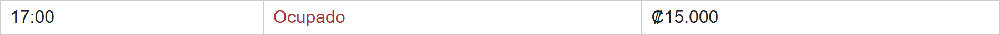
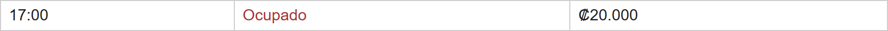
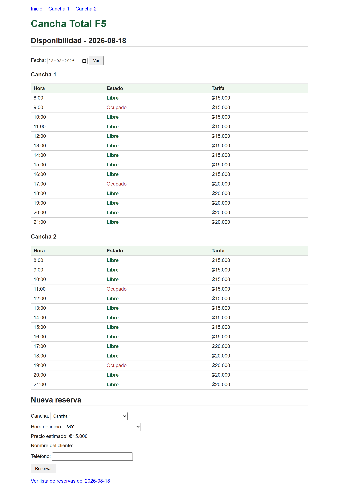
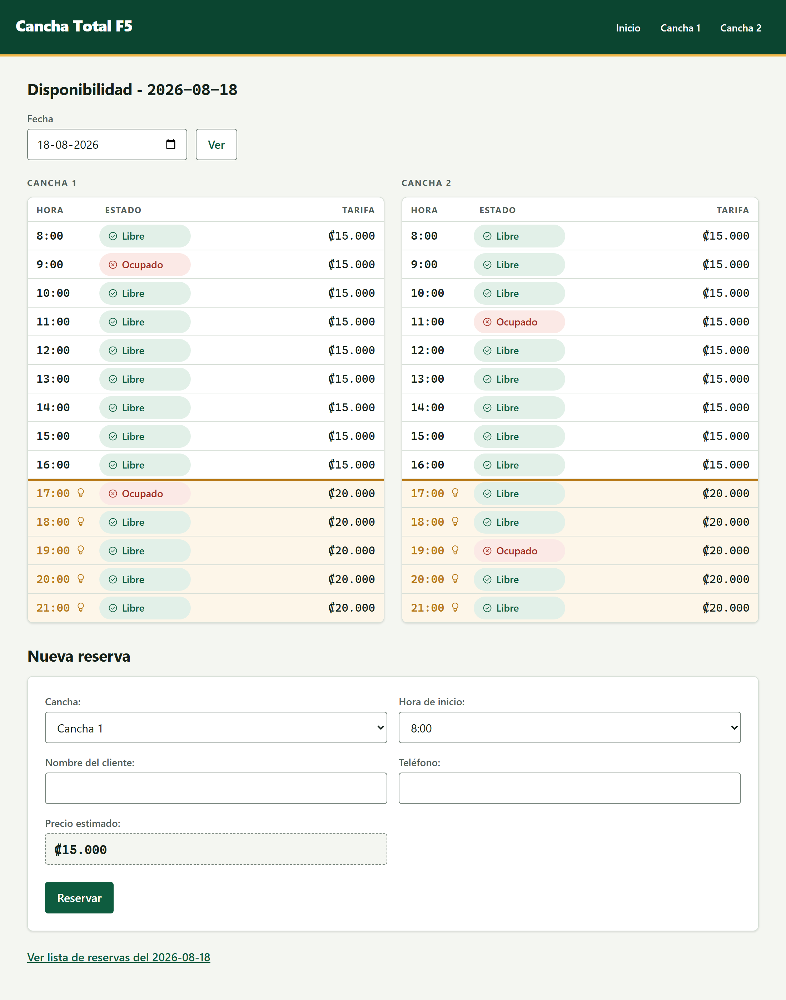

# Caso Práctico 5 — Cancha Total F5

**El código de la entrega no está en esta carpeta: vive en su propio repositorio.**

👉 **https://github.com/jcyanez/cancha-total-f5**

El encargo era ponerle una red de pruebas a un sistema de reservas heredado, sin documentación y
sin el proveedor que lo escribió. La consigna exige entregar *el repositorio recibido con los
commits propios encima*, conservando el commit del proveedor (`65ce4b4`) — por eso ese historial
se publica aparte y no se aplana dentro de este repositorio del curso.

Ahí están la especificación reconstruida, la suite, los hallazgos, la puerta de calidad y la
refactorización, en **21 commits** que se leen como el relato del trabajo:

| | |
|---|---|
| **Punto de partida** | `65ce4b4`, el sistema tal como lo entregó el proveedor. No se toca. |
| **La red** | `ESPECIFICACION.md` con 61 condiciones y su fuente declarada, 71 pruebas, `HALLAZGOS.md`, `verificar.sh` y el hook `Stop`. Todo **antes** de tocar una línea del sistema. |
| **La refactorización** | 8 commits de estructura y 6 de comportamiento, nunca mezclados. |
| **Al terminar** | **87 pruebas en verde, ninguna marcada.** Los 6 hallazgos de comportamiento cerrados y las 10 deudas de estructura pagadas. |

Ningún hallazgo se cerró tocando su prueba: en cada cierre, lo único que cambió en el archivo de
pruebas fue quitarle la marca de fallo esperado. El detalle de cada uno, con la evidencia, está en
el `HALLAZGOS.md` de ese repositorio.

## Qué hay en esta carpeta

- [CLAUDE.md](CLAUDE.md) — cómo se trabaja el caso: fuente de verdad, orden de trabajo y restricciones.
- `Consigna Caso Practico 5 - SINT-732.docx` — el enunciado y la rúbrica.
- [capturas/](capturas/) — tres tandas del sistema, con las herramientas que las generan. Son
  reproducibles: reloj congelado y base de datos propia, así que salen iguales corran el día que
  corran.

| Tanda | Qué muestra |
|---|---|
| [`capturas/antes/`](capturas/antes/) | El sistema tal como lo entregó el proveedor. |
| [`capturas/despues/`](capturas/despues/) | Después de la refactorización. **No se vuelve a generar**: su valor está en que ocho de las trece salieron idénticas byte a byte. |
| [`capturas/interfaz/`](capturas/interfaz/) | Después de la mejora visual, posterior a la entrega. Agrega tres pantallas a 375 px y una en tema oscuro. |

## Ver el hallazgo de un vistazo

El bloque de las 17:00 en la grilla de disponibilidad:

| Antes | Después |
|---|---|
|  |  |

Los bloques de las 16:00 y las 18:00 quedaron **idénticos byte a byte** entre las dos tandas de
capturas: el arreglo movió el borde de la tarifa, y nada más.

De las 13 capturas, **5 cambiaron y 8 quedaron idénticas byte a byte**. Las que cambiaron son las
que muestran el bloque de las 17:00 y las dos del formulario: registrar sin teléfono ahora se
rechaza, que es el hallazgo C-2. Las otras ocho no se movieron, y esa es justamente la prueba de
que la refactorización no rompió lo que ya funcionaba.

## La mejora visual, después de la entrega

Cerrado el caso, el sistema recibió una **capa de presentación**: solo cómo se ve y cómo se
siente, sin tocar qué hace. Mismos textos, mismos precios, mismas rutas, misma suite —**87 en
verde antes y después**— y ningún archivo de `pruebas/` en el diff.

| Al entregar el caso (`capturas/despues/`) | Con la capa visual (`capturas/interfaz/`) |
|---|---|
|  |  |

La idea es una sola: **la grilla explica por qué sube la tarifa**. A las 17:00 se encienden las
luces de las canchas techadas y el bloque pasa de ₡15.000 a ₡20.000. Ahora los bloques con luz
van sobre fondo cálido, llevan la marca de un foco y una regla ámbar cruza la tabla justo en la
frontera. El precio deja de ser un número que cambia sin motivo visible.

Todo el aspecto nuevo está hecho **con CSS sobre el markup que ya existía**, porque quince
pruebas leen el HTML con expresiones regulares que exigen etiquetas pegadas y sin nada anidado.
El detalle de esas restricciones está en el `README.md` del repositorio del sistema.

Tres defectos aparecieron solo al mirar el sistema renderizado —la suite no los podía ver, porque
no son markup sino distribución— y están anotados con su causa en el `STATUS.md` de ese
repositorio. Uno de ellos dejó herramienta: `medir-ancho.js`, que recorre las pantallas a un
ancho dado y nombra a quien se escapa del recorte.

## Regenerar las capturas

```
cd capturas/herramienta
npm install
node capturar.js interfaz   # o: antes | despues
node medir-ancho.js 375     # ¿alguna pantalla scrollea de lado?
```

Necesita el sistema clonado en `../../cancha-total/` con sus dependencias instaladas.

`antes` y `despues` no se vuelven a correr: son la evidencia de la refactorización, y volver a
generarlas con el sistema de hoy mezclaría el arreglo de comportamiento con el rediseño.
